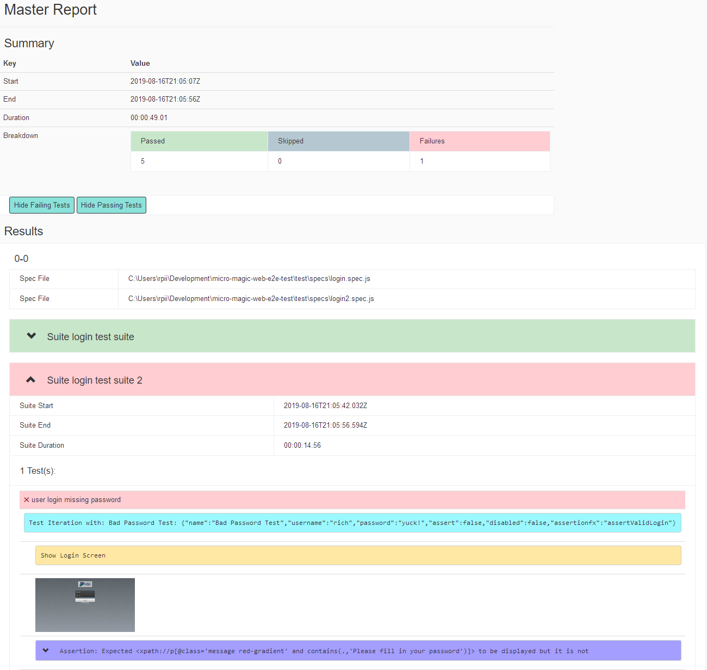

# wdio-html-reporter
A reporter for webdriver.io which generates a HTML report.
This project is a fork of [wdio-html-format-reporter](https://www.npmjs.com/package/wdio-html-format-reporter)
That project has not been updated and doesnt work with the latest webdriverio.
This project does. A pull request was submitted to that project, but it appears to be inactive.
Due to name conflict issues,  this package had to be put in my user namespace. it is now in npm.

## Installation

The easiest way is to keep the `@rpii/wdio-html-reporter` as a devDependency in your package.json:

```javascript
{
  "devDependencies": {
    "@rpii/wdio-html-reporter": "~0.5.0"
  }
}
```

Or, you can simply do it with:

```
yarn add @rpii/wdio-html-reporter --dev
```


## Configuration
The following code shows the default wdio test runner configuration. Just add 'html-format' as another reporter to the array:

```javascript
// wdio.conf.js
import { ReportAggregator, HtmlReporter} from '@rpii/wdio-html-reporter' ;
module.exports = {

  
  reporters: ['spec',
        [HtmlReporter, {
            debug: true,
            outputDir: './reports/html-reports/',
            filename: 'report.html',
            reportTitle: 'Test Report Title',
            showInBrowser: true,
            // templateFilename: path.resolve(__dirname, '../src/wdio-html-reporter-alt-template.hbs'),
            // templateFuncs: {
            //     addOne: (v) => {
            //         return v+1;
            //     },
            // },
            LOG: log4j.getLogger("default")
        }
        ]
    ]
    
 
};
```

## To use a logger for debugging

A new feature for developers is to add a logger to see whats happening.  See the report.test.js for configuration
 

## To use a custom template for reports

Uncomment the templateFilename above.  You must provide an absolute path to the file you can modify the alt-template above if you wish
The template must be modified from the default template, just change the formatting and css.


      
## To generate a master report for all suites

Add the following event handlers to you wdio.config.js

```javascript
    onPrepare: function (config, capabilities) {

        let reportAggregator = new ReportAggregator({
            outputDir: './reports/html-reports/',
            filename: 'master-report.html',
            reportTitle: 'Master Report'
        });
        reportAggregator.clean() ;

        global.reportAggregator = reportAggregator;
    },
    
    onComplete: function(exitCode, config, capabilities, results) {
        (async () => {
            await global.reportAggregator.createReport( {
                config: config,
                capabilities: capabilities,
                results : results
            });
        })();
    },
    
``` 
## To show messages in the html report
```javascript
    logMessage(message) {
        process.emit('test:log', message);
    }
```
## To take a screenshot after test assert:   
```  
wdio.conf.js

    afterTest: function (test) {
        const path = require('path');
        const moment = require('moment');

        // if test passed, ignore, else take and save screenshot.
        if (test.passed) {
            return;
        }
        const timestamp = moment().format('YYYYMMDD-HHmmss.SSS');
        const filepath = path.join('reports/html-reports/screenshots/', timestamp + '.png');
        browser.saveScreenshot(filepath);
        process.emit('test:screenshot', filepath);
    },
```


